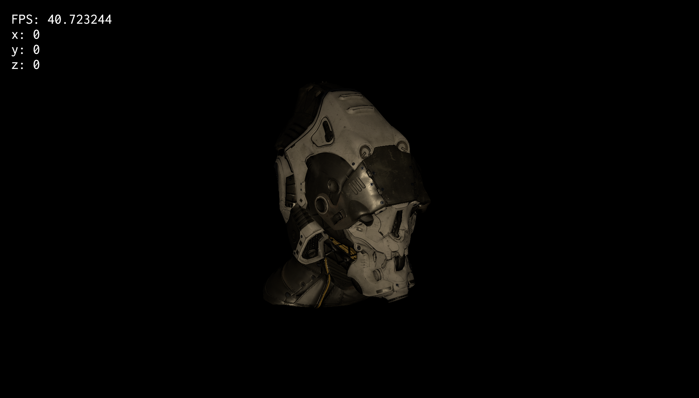
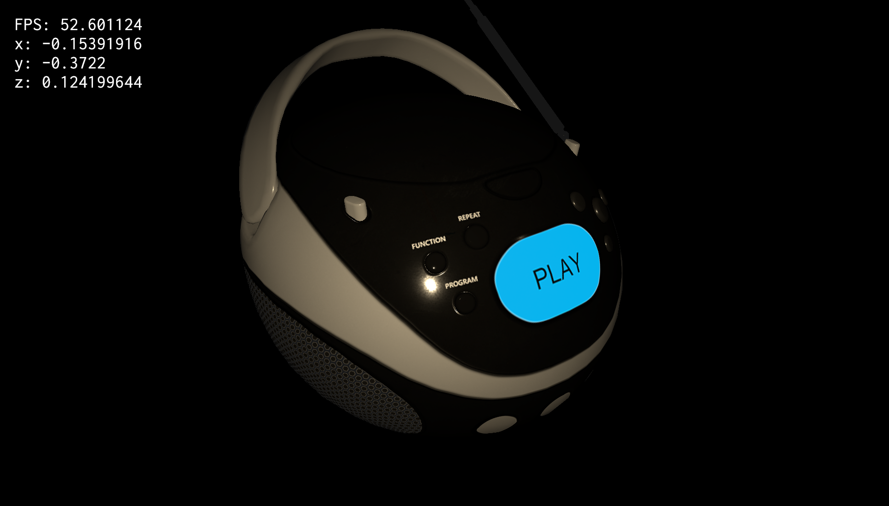
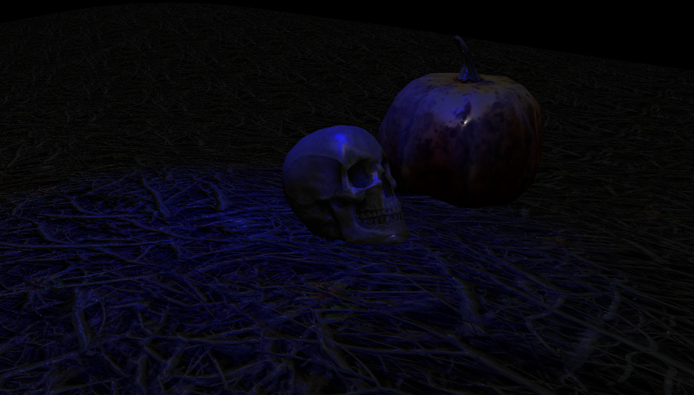
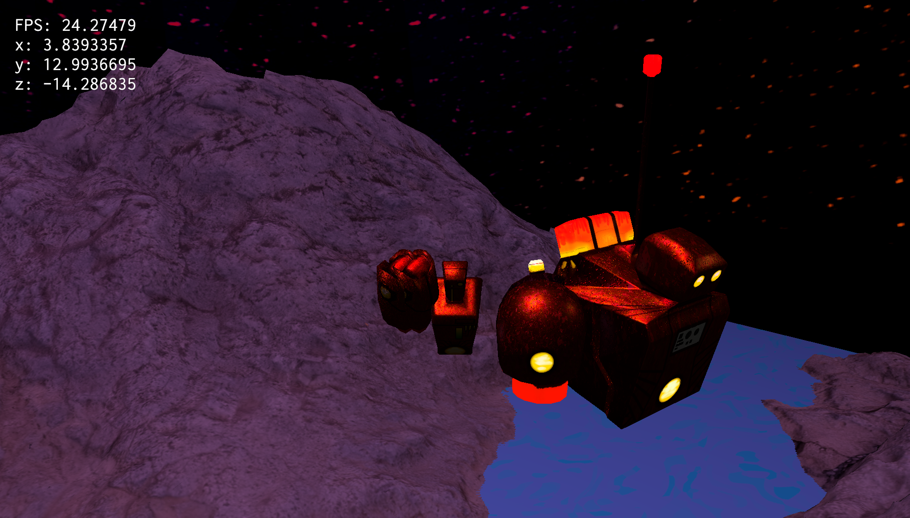

# wgpu-pbr

wgpu-pbr is a realtime physically-based renderer (PBR) intended for use in games. It is not a game engine - you will still need to handle input, build a game loop, fix your timestep, integrate with a physics engine, etc.

Credit is due to rendy-pbr and Amethyst, which the shaders are heavily derived from. Author is by no means a graphics programmer.

## Screenshots

## Features

- [x] PBR materials
    - base texture
    - normal map
    - metallic roughness
    - ambient occlusion
    - emissive
- [ ] Lights
    - [x] Point lights
    - [x] Spot lights
    - [ ] Directional lights
- [ ] HDR environment maps
- [ ] Bloom
- [ ] Shadows
- [ ] Skeletal animations
- Assets
    - [x] glTF
    - [x] Wavefront OBJ via tobj (with custom .mtl attributes for PBR materials)

# License

MIT

# Assets

SciFiHelmet and BoomBox models are from the glTF Samples repository. BoomBox was originally created by Microsoft and is licensed under the public domain. SciFiHelmet was created by Michael Pavlovich for Quixel and is licensed under the CC-Attrib 4.0 license.
